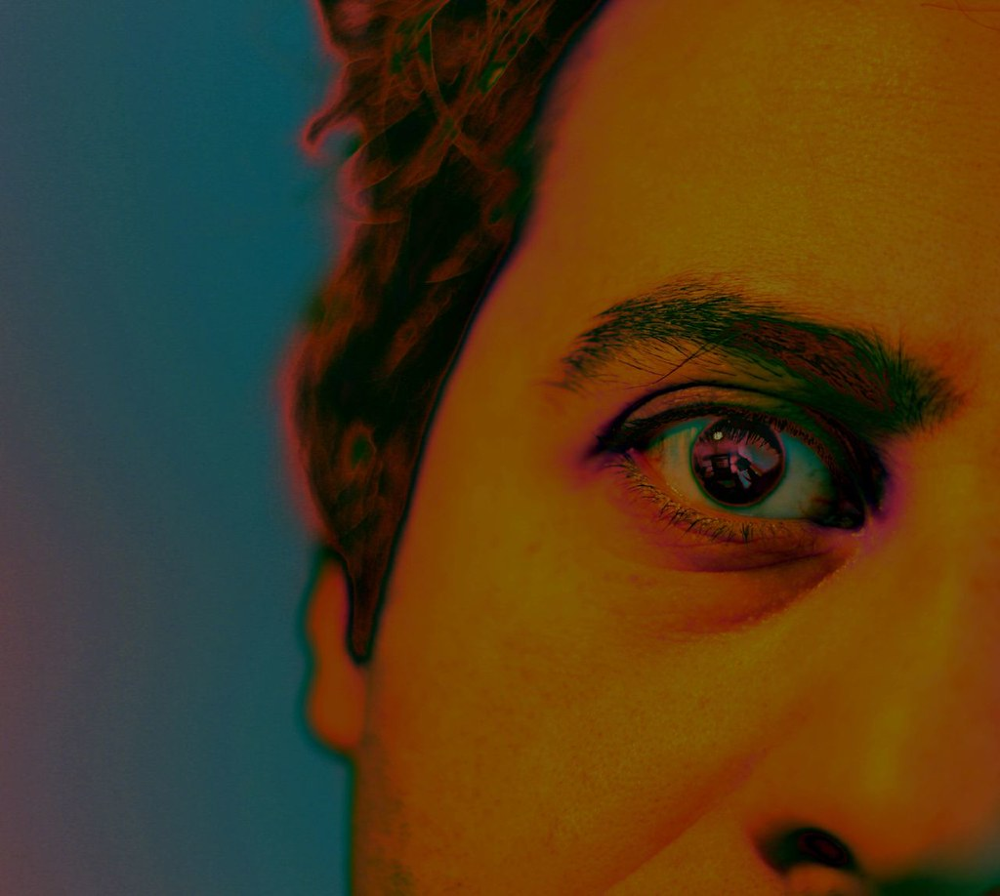

*'anxiety' by FlickrJunkie is licensed with CC BY-NC-SA 2.0. To view a copy of this license, visit https://creativecommons.org/licenses/by-nc-sa/2.0/*

Imposter Syndrome. Perfectionism. Constantly trying to keep up with the latest trends. A sense of responsibility and a desire to set a good example.

Maybe these things aren't unique to being a data analyst, but lately I've felt like my line of work isn't good for me.

Anxiety and depression are nothing new in my life: for years I self-diagnosed myself as socially anxious, and that still holds as a description of my behaviour even if it might not meet clinical criteria for a diagnosis. I'm introverted, self-conscious, and constantly afraid I'll say the wrong thing. When present in a group I have no idea who to focus on and what to say, and my mind is constantly assessing the body language, words, and possible thoughts of everyone in that group. It's exhausting, so I mostly avoid it - and I've probably missed a lot of opportunities as a result, not to mention friends I never made.

Lately I've taken a more pragmatic approach: I don't enjoy socialising in groups, so I mostly stick to situations I'm comfortable with. It helps that we're living through a pandemic and much of the last 18 months has been spent working at home in my bubble, with my wife and my cat (and soon a puppy). I used to avoid this avoidance, or at least give myself a hard time about it: it felt like giving in by not putting myself out there, whereas now it feels like a kind of acceptance of who I am and what are my limitations. Instead of agonising over what I may be missing out on, I enjoy what I have. And I have a lot.

And yet.

Am I confident that those numbers are correct? Did I remember to use `distinct()` on the right field in that many-to-many table I'm visualising for tomorrow's meeting?

Am I editorialising by presenting the data in this way? Will they think I'm making a judgement here? Should I even show this? Am I failing to be transparent if I don't?

Am I involving the right people in this work? Will others feel left out? Will they become angry that the end product doesn't meet their needs, even if I intended to approach them later?

Am I in danger of offending my colleagues if I point out that the visualisation they've published isn't very clear? Who am I to think I know any better anyway? All those people on my Twitter know so much more than me, I'm a nobody.

And on. And on. And on. Day after day.

Lately I've been practising mindfulness, twice a day most days. It's made me more aware of my anxieties and of how my thoughts spiral, sometimes to the point where things begin to seem pretty hopeless, the world slows down, and I want to cry. Does the increased awareness help? I suppose it's given me enough clarity to write this, for you who may feel the same and shouldn't feel like you're alone. You're not, even if your own thought spiral is different to mine.

So what's the way forward here? To quit my job? I don't think so - being a data analyst is probably just something that offers a particular flavour of this thing that's always been with me.

But then why does it feel that working in this area is so loaded with *getting it right*, and *doing it well*? Is that just the thought spiral again, or is there some truth to that? Do we, us data analysts and data scientists and data storytellers, do we bring a kind of pressure to what we do that is harmful to ourselves?

In recent weeks colleagues have described my work as clear, informative, interesting, useful. Thank you for all your mahi, they've said.

And yet.

Lately I feel like what I do isn't good for *me*.
