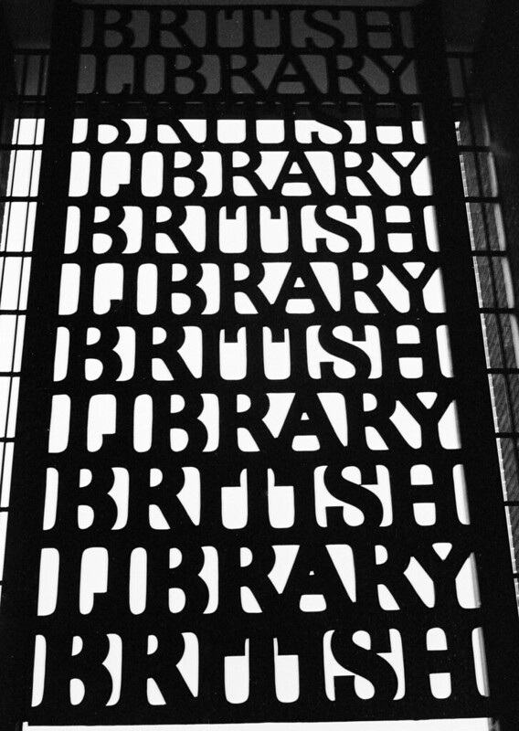

## [tidybnb](https://github.com/lddurbin/tidybnb) is a work-in-progress R package that grew from my curiosity about how many history books published in the UK each year were written by women.

---

### His Story Today, Her Story Tomorrow?

Back in December 2016 I noticed something strange about the list of recommended books in that month's edition of [*History Today*](https://www.historytoday.com/), "the world's leading serious history magazine": most of them were written by men.

Having subscribed to the magazine for a year by that point, I decided to browse through the back issues in my possession to create a dataset of how many articles in the magazine were written by women, as well as how many of the books they reviewed were written by women, and how many of the book reviewers were women. Having done this, I [visualised the data in Tableau](https://public.tableau.com/app/profile/lee.durbin/viz/History_Today/HisStoryTodayHerStoryTomorrow) and [blogged](https://treigladau.wordpress.com/2016/12/18/his-story-today-her-story-tomorrow/) about the whole thing.

There was a bit of a fuss about it on Twitter, and the magazine's editor [wrote a response](https://medium.com/@historytoday1951/a-response-to-his-story-today-her-story-tomorrow-2a172f8090d1). [Dr Fern Riddell](https://twitter.com/FernRiddell) encouraged women to pitch their work to the magazine, which many did. And the world moved on.

### A Thousand Choices

Looking at my analysis, you might raise a reasonable point: what if the lack of female-authored history books reviewed in *History Today*'s 2016 issues due to the fact that not a lot of history books by women were published in that year?

The obvious place that could help me to answer this question is the British Library, so I duly contacted them to ask for data on history books published in 2015 (the last full year of data they had), and the gender of the author(s). But it turned out they don't record the author's gender, so instead I scanned through the titles, did a bit of light Googling, and published [a follow-up blog post](https://treigladau.wordpress.com/2017/01/25/a-thousand-choices/) where I highlighted a bunch of history books written by women.

My plan was to use some sort of resource to approximate the gender of the names in the list of authors, but for various reasons it never worked out (and we can argue about the merits of such an exercise ad nauseam). With other things to focus on, I left this project behind and moved on with my life.

### @ukhistorybooks
Things changed in 2020, when I learned how to code in R. As I became acquainted with the language's rich ecosystem of packages, an idea formed: what if I could use British Library data to tweet about new history books published in the UK?

To achieve this, I wrote a bunch of scripts that scrape the [New British National Bibliography records page](https://www.bl.uk/collection-metadata/new-bnb-records) on the British Library's website, download the RDF files listed there, filter the data to get the forthcoming history titles, and supplement them with data from Google Books. Using this data (including a synopsis of the book and its cover image), I form a tweet that gets posted to [@ukhistorybooks](https://twitter.com/ukhistorybooks) every 30 minutes.

I was pleased with the result, but it requires a lot of work to pull off. There's a rich dataset underneath it all, and I wanted to make easier for others to access and explore - hence the tidybnb package.

### tidybnb

